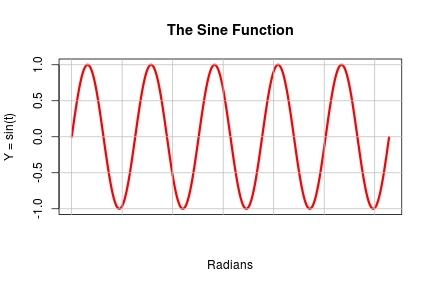
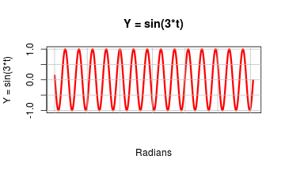
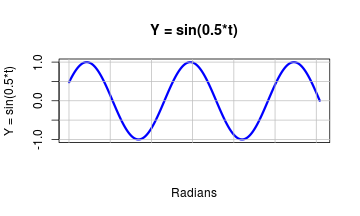
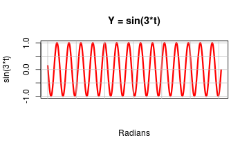
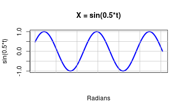
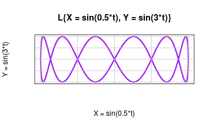
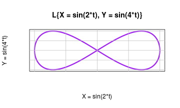
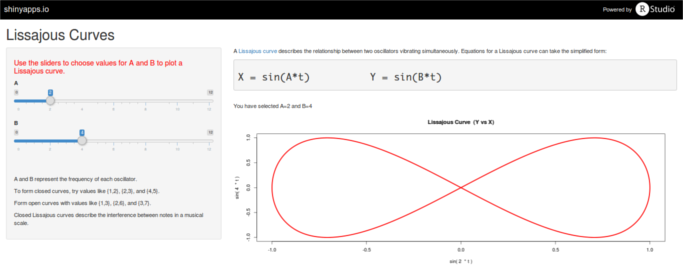

## Slide 1

A <a href=https://en.wikipedia.org/wiki/Lissajous_curve>Lissajous curve</a> is a tool for compairing  trigonometric sine functions. The curve is used in signal processing, audio engineering, and many other disciplines.

The basic sine function $Y = sin(t)$ looks like this:

--- 

## Slide 2

If we multiply the variable $t$ by some number, we can either stretch out or compress the graph.

  

We say that these two graphs have different <i>periods</i> or <i>frequencies</i>. Plotting one of these sines on the X-axis, and the other on the Y-axis, creates the Lissajous curve and makes it easy to compare pairs of sine functions with different frequency relationships.

---

## Slide 3

The Lissajous curve for the previous two sine functions $Y=sin(3*t)$ and $X=sin(0.5*t)$
  

looks like this:

---

## Slide 4

The Lissajous curve for a different pair of sine functions $Y=sin(4*t)$ and $X=sin(2*t)$
  

looks like this:

A <a href=https://en.wikipedia.org/wiki/Lissajous_curve>Lissajous curve</a> describes the relationship between two oscillators vibrating simultaneously. Equations for a Lissajous curve can take the simplified form:

<pre><h5>X = sin(A*t)          Y = sin(B*t)</h5></pre>

---

## Slide 5

Use the Lissajous app at <a href="https://r-handsfield.shinyapps.io/lissajous_app">https://r-handsfield.shinyapps.io/lissajous_app</a> to compare different pairs of sine functions. Move the sliders to change each function's frequency, then view the resulting Lissajous curve.

